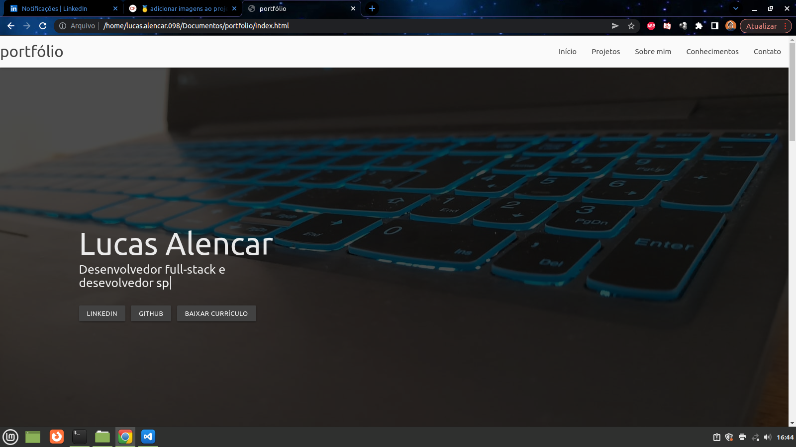

# Portfólio - Lucas Alencar

## Descrição
Esse portfólio foi feito em HTML5, Javascript e CSS3, com o auxílio do framework "Materialize CSS" que implementa o conceito de material design. É um design SPA.s

## Para executar
 Para compilar, basta baixar o projeto aqui pelo github e abrir o arquivo index.html com auxílio do seu navegador.

